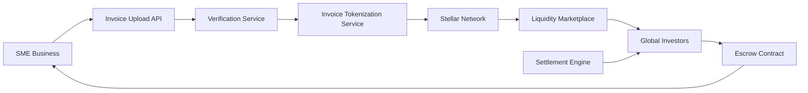
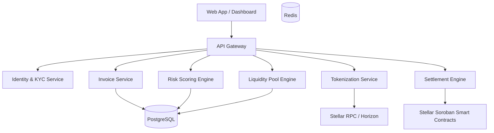
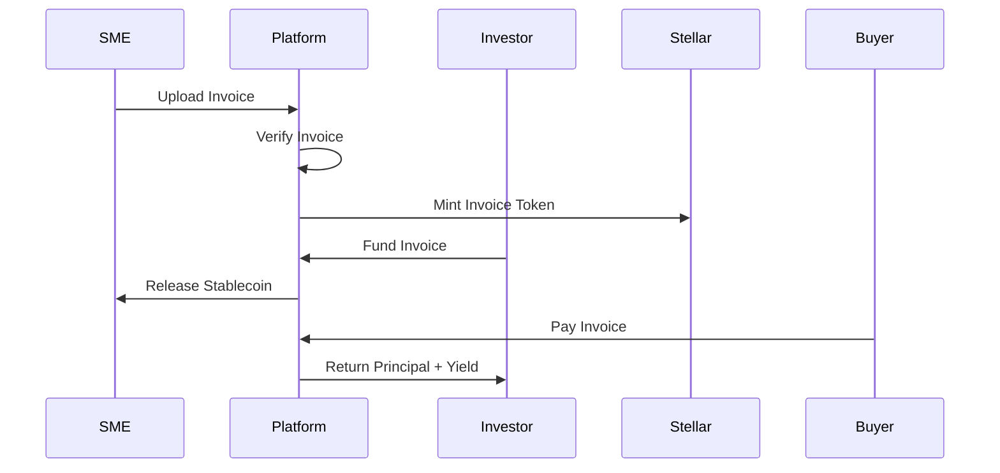
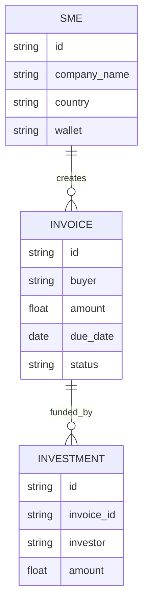

# LiquiFact  
### Global Invoice Liquidity Network on Stellar

LiquiFact is a decentralized invoice financing protocol built on the **Stellar network** that enables small and medium businesses (SMEs) to unlock liquidity from unpaid invoices instantly.

The platform tokenizes invoices as **real-world assets (RWAs)** and allows investors to fund them, providing immediate working capital to businesses while earning returns.

---

# 1. Problem

Small and medium enterprises (SMEs) often operate with **long payment cycles (30–90 days)**.

Typical scenario:

1. Supplier delivers goods/services
2. Buyer agrees to pay after 30–90 days
3. Supplier needs cash immediately to continue operations

### Current Issues

| Problem | Impact |
|---------|--------|
| Long payment cycles | Cash flow issues |
| Banks reject SMEs | Lack of credit history |
| Factoring companies charge 10–30% | Extremely expensive |
| Cross-border invoices | Slow settlement |
| Manual verification | High operational overhead |

This results in **trapped working capital for SMEs globally**.

The **global invoice factoring market exceeds $3 trillion annually**.

---

# 2. Solution

LiquiFact introduces a **tokenized invoice financing marketplace** built on Stellar.

Invoices become **digital assets** that investors can fund.

### Core Flow

1. SME uploads invoice
2. Invoice is verified
3. Invoice is tokenized as a **Stellar asset**
4. Investors fund the invoice
5. SME receives instant stablecoin liquidity
6. Buyer pays at maturity
7. Investors receive repayment + yield

---

# 3. Key Features

### Invoice Tokenization
Invoices are converted into tokenized assets on Stellar.

Example:

```
Invoice #INV-1023
Amount: $10,000
Due: 60 days
```

Tokenized as:

```
LF-INV-1023
```

### Instant Liquidity

SMEs receive stablecoins immediately instead of waiting months.

### Global Access

Investors worldwide can participate in invoice funding.

### Risk Scoring Engine

AI-based scoring evaluates:

- Buyer credibility
- SME payment history
- Industry risk
- Invoice value

### Insurance Pools

Liquidity providers can contribute to **risk pools** that insure invoice defaults.

---

# 4. Why Stellar

LiquiFact is built on the **Stellar blockchain** because of its strengths:

| Feature | Benefit |
|---------|---------|
| Ultra low fees | Enables micro-financing |
| Fast settlement | ~5 seconds |
| Native asset issuance | Easy tokenization |
| Built-in DEX | Liquidity |
| Global stablecoins | USDC / EURC |

---

# 5. System Architecture



---

# 6. Component Architecture



---

# 7. Smart Contract Architecture

The protocol uses Soroban smart contracts for escrow and settlement.



---

# 8. Token Model

Invoices are represented as tokenized assets.

| Field | Value |
|-------|-------|
| Invoice ID | INV-1202 |
| Token | LF-INV-1202 |
| Amount | $10,000 |
| Maturity | 60 days |
| Yield | 8% |

---

# 9. Risk Management

LiquiFact implements multiple risk mitigation mechanisms.

**Risk Layers**

- AI credit scoring
- Buyer verification
- Invoice authenticity verification
- Insurance liquidity pools
- Diversification

---

# 10. Tech Stack

**Frontend**

- React
- Next.js
- TailwindCSS
- Stellar Wallet integration

**Backend**

- Golang
- Node.js (API layer)
- gRPC microservices
- REST APIs

**Blockchain**

- Stellar Network
- Soroban smart contracts
- Horizon API
- Stellar SDK

**Infrastructure**

- Docker
- Kubernetes
- PostgreSQL
- Redis
- AWS / GCP

**AI Risk Engine**

- Python
- XGBoost
- Fraud detection models

---

# 11. Data Model



---

# 12. Revenue Model

LiquiFact generates revenue through:

| Revenue Stream | Fee |
|----------------|-----|
| Invoice financing fee | 1–2% |
| Liquidity marketplace spread | 0.5–1% |
| Risk scoring API | Subscription |
| Insurance pool fee | % of premium |

---

# 13. Security Considerations

- Multi-signature treasury
- Invoice fraud detection
- KYC verification
- Buyer verification
- Oracle validation
- Contract audits

---

# 14. Future Roadmap

**Phase 1**
- Invoice tokenization
- Funding marketplace
- Escrow contracts

**Phase 2**
- AI risk engine
- Cross-border invoices
- Secondary invoice market

**Phase 3**
- Insurance pools
- Institutional investors
- On-chain credit scores

---

# 15. Potential Impact

LiquiFact unlocks trapped working capital for millions of SMEs globally.

**Benefits:**

- Instant liquidity
- Lower financing costs
- Global investor access
- Transparent financing markets

---

# Project Structure

```
liquifact/
├── contracts/     # Soroban smart contracts (escrow, settlement)
├── backend/       # Express API server
├── frontend/      # Next.js web app
└── README.md
```

## Quick Start

- **Contracts**: `cd contracts && cargo build`
- **Backend**: `cd backend && npm install && npm run dev`
- **Frontend**: `cd frontend && npm install && npm run dev`

---

**License**: MIT
